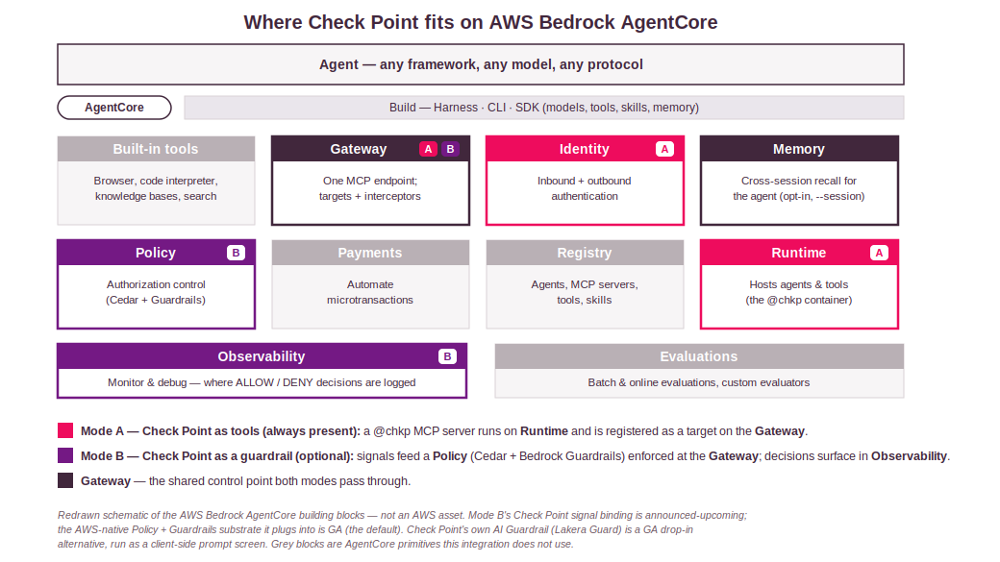
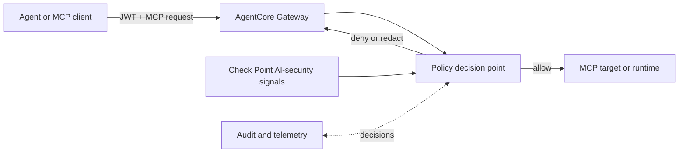
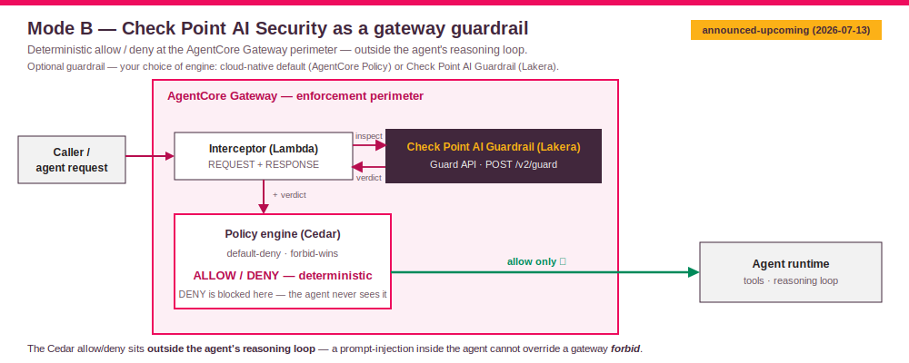

# Scenario: AI Guardrail — Design

AI guardrail is the policy-enforcement companion to MCP tools. Instead of exposing Check Point as tools the agent can call, the gateway becomes the control point that evaluates whether agent activity should be allowed, denied, transformed, or audited.

This repository does not yet deploy Check Point's **native signal binding into AgentCore Policy** — that gateway-level binding is announced/upcoming (Early Access), and this document is its design walkthrough and implementation plan. Two things are already real, though: the **Check Point MCP tool servers** are the always-present core (they let the agent query and act on your Check Point estate), and **Check Point AI Guardrail (Lakera Guard)** ships today as an *optional*, opt-in inline pre-model screen (`chkpmcpaws chat --guardrail --guardrail-provider lakera` / `CHKP_GUARDRAIL_PROVIDER=lakera`) — one Guard API call, identical on AWS and Azure. The guardrail is the optional part; the AWS-native AgentCore-Policy engine stays the default (`--guardrail-provider gateway`).

It *can*, however, stand up the **AWS-native substrate** AI guardrail plugs into (AgentCore Policy + Bedrock Guardrails-in-Policy) so you can demonstrate real deterministic allow/deny today — see the hands-on **[AI guardrail runbook](ai-guardrail-runbook.md)** (`python3 -m chkpmcpaws guardrail provision`, then `chkpmcpaws guardrail test` for scripted traffic). Its guardrail grammar is validated live; it stays AWS-native and frames Check Point as the roadmap signal source, not something wired in.

## Status Boundary

| Layer | Status in this repo | Meaning |
|---|---|---|
| AWS AgentCore Gateway and policy substrate | GA and buildable today: AgentCore Policy (GA since March 2026) and Bedrock Guardrails-in-Policy (GA since 2026-06-17, but only in `us-east-1`, `eu-west-2` (London), `eu-north-1` (Stockholm), `ap-southeast-2` (Sydney), and `ap-northeast-1` (Tokyo)). | You can deploy real deterministic allow/deny today with the AWS-native detector categories `promptAttack`, `sensitiveInformation`, and `contentFilter` — not just design around the enforcement point. Check the region list before promising this outside those five. |
| Check Point AI-security signal binding into AgentCore policy | Not implemented here. | Do not present this repo as deploying that binding. |
| Check Point AI Guardrail (Lakera Guard) inline screen | Shipped here as an opt-in provider (`--guardrail-provider lakera`), GA. | A client-side inline pre-model screen in the CLI that blocks prompt-injection/jailbreak before the model runs (covers chat on either runtime) — one Guard API call, identical on AWS and Azure. A real Check Point product path, but distinct from native Gateway policy binding. |

AI guardrail should be described as planned architecture unless you have a separately validated, current implementation from the relevant vendors.

## Where AI guardrail sits on AgentCore

<p align="center">
  
</p>

AI guardrail centers on the **Policy** building block (Cedar authorization + Bedrock Guardrails-in-Policy), enforced at the **Gateway** perimeter, with allow/deny decisions surfacing in **Observability**. It reuses the very Gateway that MCP tools builds — the shared control point. Note the honest split: the AWS-native Policy + Guardrails substrate is GA, but Check Point's own signal binding into that policy is announced-upcoming (see the [status boundary](#status-boundary) above).

The guardrail engine is the customer's choice, and it is optional — the MCP tool servers work with no guardrail at all. Two engines are interchangeable: (1) the **cloud-native** engine, which stays the default here — AWS AgentCore Policy / Bedrock Guardrails (on Azure the equivalent default is Content Safety Prompt Shields) — so customers already invested in their cloud's guardrail keep it; and (2) **Check Point AI Guardrail (Lakera Guard)**, a drop-in opt-in provider (`--guardrail-provider lakera`) that is one Guard API call, identical on AWS and Azure, for customers who want a single unified guardrail across both clouds. We do not force Lakera; it is opt-in.

## Target Architecture



The important design move is that enforcement sits outside the agent's reasoning loop. The agent does not get to decide whether a risky tool call should proceed; the gateway evaluates policy before the request reaches the target.

<p align="center">
  
</p>

## What AI guardrail Is For

Use this design when you need to control questions like:

- Should this agent be allowed to call this tool at all?
- Should this user, tenant, workload, or client be allowed to call this target?
- Is the request prompt-injected, malicious, exfiltrating, or out of policy?
- Should the response be blocked, redacted, or annotated before returning to the agent?
- Which decisions need audit records for incident response or compliance?

AI guardrail complements MCP tools. MCP tools makes Check Point capabilities available as tools. AI guardrail controls whether agent traffic should proceed. The MCP tool servers are always present (the core integration); the guardrail is an optional add-on the customer can enable with the engine of their choice.

## Enforcement Points

A complete guardrail design has at least four enforcement points:

| Point | Question | Example decision |
|---|---|---|
| Client authentication | Who is calling the gateway? | Only accept JWTs from approved clients. |
| Tool authorization | Which tools can this caller use? | Permit read-only inventory tools; deny mutation tools. |
| Request inspection | Is the request safe? | Deny prompt-injection or credential-exfiltration attempts. |
| Response inspection | Is the response safe to return? | Redact secrets or block sensitive data leakage. |

MCP tools already implements the first part with Cognito JWT inbound authentication. AI guardrail adds richer policy decisions and AI-security signals.

## Signal Model

For a practical implementation, normalize every guardrail input into a policy context object. The exact schema will depend on the eventual integration, but the design usually needs these fields:

| Field group | Examples |
|---|---|
| Identity | Client ID, user ID, tenant ID, workload identity, source account. |
| MCP metadata | Tool name, target name, method, protocol version, request ID. |
| Agent context | Agent ID, session ID, conversation ID, model provider, model ID. |
| Request risk | Prompt-injection verdict, jailbreak verdict, malware/phishing verdict, sensitive-data request verdict. |
| Response risk | Secret exposure, policy data exposure, malicious content, unsafe generated actions. |
| Environment | Region, network path, VPC, source IP if available. |
| Decision trace | Policy version, rule IDs, signal version, confidence, timestamp. |

The policy engine should not receive raw secrets. It should receive facts and verdicts needed for the decision.

## Policy Shape

The final syntax depends on the AgentCore policy mechanism you use. Conceptually, the rules look like this:

```text
allow tools/list for approved clients with gateway-resource-server/read scope
allow read-only Check Point tools for approved security-operations clients
deny any request with high prompt-injection risk
deny tool calls that mutate production policy unless caller is in a break-glass group
deny or redact responses that contain secrets or credential material
audit all denied decisions with request ID, tool name, target name, and signal summary
```

An illustrative Cedar-like shape might be:

```cedar
permit(principal, action, resource)
when {
  principal.scope.contains("gateway-resource-server/read") &&
  resource.target in ["quantummanagement", "managementlogs"] &&
  context.checkpoint.risk != "high"
};

forbid(principal, action, resource)
when {
  context.checkpoint.promptInjection == true ||
  context.checkpoint.secretExposure == true
};
```

Treat this as explanatory pseudocode, not a drop-in policy file.

## Implementation Plan

### Phase 1: Define the Policy Contract

Decide which facts the policy needs before selecting tooling:

1. Identity attributes from JWT and workload identity.
2. MCP method and tool name.
3. Target name and backend product family.
4. Request inspection verdicts.
5. Response inspection verdicts.
6. Required audit fields.

This contract is the boundary between Check Point signals, AWS policy evaluation, and operations.

### Phase 2: Choose Synchronous Versus Asynchronous Enforcement

Synchronous enforcement blocks or allows the request before it reaches the target. This is required for high-risk activity such as prompt injection, exfiltration, or unsafe tool calls.

Asynchronous analysis records and alerts after the fact. It is useful for trend detection and incident response, but it is not enough for hard prevention.

Most production designs need both.

### Phase 3: Attach Identity and Target Attributes

Identity and target attributes should be stable and policy-friendly:

| Attribute | Example |
|---|---|
| `principal.client_id` | Cognito app client ID. |
| `principal.tenant` | Enterprise tenant identifier. |
| `resource.target` | `quantummanagement`. |
| `resource.product` | `quantum-management`. |
| `action.method` | `tools/call`. |
| `action.tool` | `show_hosts`. |

Avoid policies that depend on fragile natural-language prompts alone.

### Phase 4: Integrate Check Point Signals

Once a supported Check Point-to-AgentCore binding is available, connect it at the policy decision point or supported Gateway interception point.

Implementation questions to answer during integration:

- Does the signal provider inspect requests, responses, or both?
- Is the signal synchronous enough to block the request?
- What is the timeout behavior if the signal provider is unavailable?
- Does failure default to allow, deny, or degraded mode?
- Which signal fields are safe to log?
- How are signal model versions pinned and audited?

### Phase 5: Validate With Adversarial Cases

Build a validation set before enabling broad traffic:

| Test class | Expected result |
|---|---|
| Normal `tools/list` | Allowed. |
| Normal read-only Check Point query | Allowed for approved clients. |
| Unauthorized target access | Denied. |
| Prompt-injection attempt asking the agent to ignore policy | Denied or flagged. |
| Request for credentials or secrets | Denied. |
| Response containing secret-like data | Redacted or blocked. |
| Signal provider timeout | Matches your documented fail-open or fail-closed policy. |

## Relationship to MCP tools

MCP tools and AI guardrail can be layered:

| Layer | Role |
|---|---|
| MCP tools | Gives agents managed access to Check Point tools. |
| AI guardrail | Controls whether agent traffic is allowed to reach tools or return responses. |

In a combined design, the Gateway is both the MCP aggregation point and the enforcement point.

## What You Can Do Today

Without claiming a native Check Point signal binding, you can still prepare the design:

- Keep MCP tools target names stable and meaningful.
- Use separate Cognito clients or identity attributes for different agent classes.
- Keep read-only and high-risk tools separated by target or product family when possible.
- Capture enough logs to correlate client, target, tool, request ID, and decision.
- Prototype inline guard checks in agent code for selected workflows, clearly labeling them as inline application enforcement rather than native Gateway policy binding.

## Gotchas

- Do not rely on the agent to self-police. Policy should be outside the agent loop.
- Do not log raw secrets, bearer tokens, API keys, or full sensitive payloads.
- Do not over-claim AI guardrail as deployed by this repo.
- Do not mix detection-only telemetry with enforcement language. If it cannot block, call it monitoring or alerting.
- Decide fail-open versus fail-closed behavior before production traffic.

## Handoff Checklist

Before presenting AI guardrail, confirm:

- Current vendor status and supported regions.
- Supported AgentCore policy features.
- Check Point signal fields and latency.
- Timeout and failure behavior.
- Audit-log destination and retention.
- Customer policy examples reviewed by the account team.