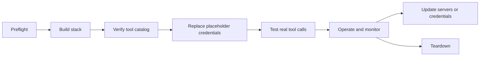

# Scenario: Go-Live and Operations

Use this document after the stack is understood and you are preparing to run it with real credentials, update it, troubleshoot it, or tear it down.

The scripts are field automation for a fixed-name stack in `us-east-1`. They are not a full production IaC system. For durable customer environments, translate the resource model into CloudFormation, CDK, Terraform, or your organization's standard deployment system.

## Operational Lifecycle



## Preflight

The fastest first step is the CLI's own read-only preflight — it checks your Python and boto3 versions plus credential/region readiness and creates or changes nothing:

```bash
python3 -m chkpmcpaws doctor
```

To confirm identity and AgentCore control-plane access directly:

```bash
aws sts get-caller-identity
aws bedrock-agentcore-control list-gateways --region us-east-1
```

Expected result for the second command can be an empty list. That still proves the service API is reachable and your principal can list gateways.

Common failures:

| Failure | Meaning | Fix |
|---|---|---|
| `Unable to locate credentials` | AWS credentials are not configured. | Run `aws configure sso` / `aws sso login`, `aws configure` (access keys), `aws login` (if your build has it), or use CloudShell. |
| `aws login` fails with `Invalid choice` (often with a "CLI version 2 ... is now stable" banner) | The resolved `aws` is CLI **v1** or a build without the optional `aws login` subcommand. Classic cause: `pip install awscli` inside an active virtualenv -- pip's awscli is v1 and `.venv/bin/aws` shadows the system v2 whenever the venv is active. | Check `which -a aws` (with the venv active). If `.venv/bin/aws` appears: `pip uninstall awscli`, then `hash -r` or a new terminal. Never install `awscli` via pip for this repo -- the venv only needs `boto3[crt]` (+ optional `mcp`); use the AWS CLI v2 installers for the CLI itself. Or skip `aws login` and use `aws configure sso` / `aws configure`. |
| `ExpiredToken` | Credentials expired. | Refresh SSO or credentials. |
| `AccessDeniedException` | Principal lacks permissions. | Add scoped permissions for the resources listed below. |
| Unknown service or command | AWS CLI or boto3 is too old. | Upgrade AWS CLI v2 or boto3/botocore. |
| `MissingDependencyException: ... login credential provider requires an additional dependency` | boto3/botocore is reading credentials cached by the newer `aws login` browser-based device-authorization flow, which needs the AWS Common Runtime bindings. | `python3 -m pip install "botocore[crt]"`, then re-run the script. Not needed for classic `aws configure` / static-key / SSO-profile credentials -- only for the `aws login` path. |
| `CERTIFICATE_VERIFY_FAILED` on the Cognito token or MCP probe step (AWS API calls fine) | Your Python's stdlib trust store is empty -- common with python.org macOS installs where `Install Certificates.command` was never run. boto3 works regardless because botocore bundles its own CAs; only stdlib `urllib` calls hit the empty store. | The CLI detects the empty store and falls back to the certifi/botocore CA bundle automatically (verification stays ON; it logs a note when it does). To fix the interpreter itself: run `Install Certificates.command` from your Python folder, or `python -m pip install certifi`. Never disable TLS verification. |

> **A note on `aws login`.** Some AWS CLI builds ship an optional `aws login` subcommand: run it once, it asks for a region, opens a browser for authorization, and updates your `default` profile in place -- no separate `aws configure sso` step needed. **It is not in every distribution** (the standard, always-available logins are `aws configure sso` / `aws sso login` / `aws configure`); if it errors with `Invalid choice`, see the row above. Where it exists it is a convenient way to get `aws sts get-caller-identity` working locally, but its cached credentials require `botocore[crt]` (the `MissingDependencyException` row) for boto3-based tools like the `chkpmcpaws` CLI to read them. If `aws sts get-caller-identity` succeeds but a Python script still raises `NoCredentialsError` or `MissingDependencyException`, install `botocore[crt]` before assuming anything else is wrong.

## Credential Methods

The CLI uses boto3's standard credential chain -- the same one the AWS CLI uses -- so it works with whatever your environment already provides. The invariant: **if `aws sts get-caller-identity` shows the right account in your shell, `chkpmcpaws` will use that same identity.**

| Environment | What to do |
|---|---|
| AWS CloudShell | Nothing -- it inherits your console session. |
| Personal/demo tenant | `aws configure` (access keys) or `aws configure sso`. Some CLI builds also ship `aws login` (browser device-auth; needs `botocore[crt]`, which `pip install "boto3[crt]"` provides; may land on the root identity -- the CLI warns; acceptable only for throwaway tenants). |
| IAM Identity Center (SSO) | `aws configure sso` once, `aws sso login --profile <name>` per session, then `--profile <name>` (or `AWS_PROFILE`) on every `chkpmcpaws` command. |
| Named profiles / assumed roles | `--profile <name>` on any subcommand, or `export AWS_PROFILE=<name>`. Profiles that assume roles (`role_arn` + `source_profile`, including MFA prompts) resolve through the same chain. |
| Federation tools (aws-vault, saml2aws, IdP CLIs) | Run `chkpmcpaws` inside the wrapped shell / with the exported session env vars -- nothing chkpmcpaws-specific needed. |
| EC2 / containers / CI | The instance, task, or CI role is picked up automatically. Non-interactive shells must pass `--yes` to `destroy`. |

Sessions from SSO/`aws login`/assumed roles expire. A deploy takes ~10-15 minutes, so start with a fresh session; if credentials expire mid-run, re-authenticate and re-run the same command -- **every command is idempotent**, so it picks up where it left off.

## Required AWS Permissions

The CLI creates and deletes resources across STS, IAM, ECR, S3, CodeBuild, Cognito user pools, Secrets Manager, and the Bedrock AgentCore control plane (the runtime roles it creates additionally use CloudWatch Logs/metrics at execution time).

The deploying principal does **not** need admin. A least-privilege starting point scoped to this stack's fixed names is provided in [docs/iam/deployer-policy.sample.json](../iam/deployer-policy.sample.json) -- treat it as a validated-in-sandbox-first sample, not gospel:

- The easy-to-miss permission is **`iam:PassRole`** on the stack's service roles (`AgentCoreRuntimeChkpMcp`, `AgentCoreGatewayRole`, `ChkpMcpCodeBuild`; plus `AgentCoreGatewayRoleGuardrail` with the AI guardrail, `AgentCoreMemoryChkp` with `chat --session`, and `AgentCoreAgentChkp` with `--runtime agentcore`), conditioned to `bedrock-agentcore.amazonaws.com` and `codebuild.amazonaws.com`. Without it, runtime/gateway/CodeBuild creation fails even though every `Create*` action is allowed.
- AgentCore control-plane actions stay on `Resource: *` for now (service-generated ids; resource-level enforcement still settling) -- the account boundary is the effective scope.
- Cognito's `CreateUserPool`/`ListUserPools` cannot be name-scoped before the pool exists.
- If you deploy with `--prefix`, widen the name patterns in the sample accordingly.

## Resource Names

The scripts use fixed names so teardown can find what build created.

| Resource | Name or pattern |
|---|---|
| Region | `us-east-1` |
| Secrets | one per server: `chkp/<server>` |
| Runtime role | `AgentCoreRuntimeChkpMcp` |
| Gateway role | `AgentCoreGatewayRole` |
| CodeBuild role | `ChkpMcpCodeBuild` |
| ECR repo | `bedrock-agentcore-chkpmcp` |
| CodeBuild project | `chkp-mcp-build` |
| S3 source bucket | `chkp-mcp-src-<account>` |
| Gateway | `chkp-mcp-gw` |
| Cognito user pool | `gateway-user-pool` |
| Cognito resource server | `gateway-resource-server` |
| Cognito app client | `gateway-client` |
| Cognito hosted domain | `chkp-mcp-gw-<account>` |
| Runtime per server | `chkp_<server_with_underscores>` |
| Target per server | `<server_without_hyphens>` |
| AgentCore Memory *(opt-in, created by `chat --session`)* | `chkp_mcp_memory` |
| Memory execution role *(opt-in)* | `AgentCoreMemoryChkp` |
| Hosted-agent runtime *(default; skip with `deploy --no-agent`)* | `chkp_agent` |
| Hosted-agent ECR repo | `bedrock-agentcore-chkpmcp-agent` |
| Hosted-agent CodeBuild project | `chkp-mcp-build-agent` |
| Hosted-agent execution role | `AgentCoreAgentChkp` |
| Bridge API + Lambda *(opt-in, `bridge provision`)* | `chkp-agent-bridge` |
| Bridge execution role *(opt-in)* | `AgentBridgeChkp` |
| Bridge token secret *(opt-in)* | `chkp/agent-bridge` |

Do not run parallel stacks in the same account and region without renaming resources.

## Replacing Placeholder Credentials

The build creates this placeholder secret:

```json
{"MANAGEMENT_HOST":"127.0.0.1","MANAGEMENT_PORT":"443","API_KEY":"PLACEHOLDER_NOT_A_REAL_KEY"}
```

Replace it from your local terminal or AWS console. Do not commit real values to the repo.

Management API example:

```bash
aws secretsmanager put-secret-value \
  --region us-east-1 \
  --secret-id chkp/quantum-management \
  --secret-string '{"MANAGEMENT_HOST":"<host>","MANAGEMENT_PORT":"443","API_KEY":"<api-key>"}'
```

Smart-1 Cloud-style example, if the package expects `S1C_URL`:

```bash
aws secretsmanager put-secret-value \
  --region us-east-1 \
  --secret-id chkp/quantum-management \
  --secret-string '{"S1C_URL":"<smart-1-cloud-url>","API_KEY":"<api-key>"}'
```

The runtime entrypoint loads the JSON object and exports each key as an environment variable before starting the `@chkp/*` package.

## TLS Verification on the On-Prem Client

Check before you present or ship this to a customer: the on-prem client bundled in `@chkp/quantum-infra` (used by `@chkp/quantum-management-mcp` and related packages when talking to `MANAGEMENT_HOST`) hardcodes `new https.Agent({ rejectUnauthorized: false })` in both `login()` and `callApi()`. That **disables TLS certificate verification** for the connection to the on-prem management server — a self-signed certificate will not block the connection, but this is a certificate-verification bypass, not a hardening feature.

Do not treat this as acceptable for a production or customer-facing deployment. Options, in order of preference:

- Use **Smart-1 Cloud** (`S1C_URL`) instead of an on-prem `MANAGEMENT_HOST` where possible — its client path keeps TLS verification on.
- Fork or patch `quantum-infra` to remove the hardcoded `rejectUnauthorized: false` and trust the management server's real CA (setting only `NODE_EXTRA_CA_CERTS` has no effect while `rejectUnauthorized: false` is forced — the flag has to come out).
- Flag this behavior to the `@chkp` product team before relying on it for a security-sensitive customer environment.

## Credentials

### The secret model

**Every credentialed server gets its own Secrets Manager secret**, `chkp/<server>` (e.g. `chkp/quantum-management`, `chkp/cloudguard-waf`). Nothing is shared — so `quantum-management` and `management-logs` can point at *different* management servers if you want.

- Management-shaped servers (`quantum-management`, `management-logs`, `threat-prevention`, `https-inspection`, `policy-insights`, `quantum-gw-cli`) use the same credential *fields* (`MANAGEMENT_HOST`/`API_KEY` or `S1C_URL`/`API_KEY`) — but each in its own secret. Note `quantum-gw-cli` authenticates to the **Management server**, not Gaia.
- Product-specific servers (`cloudguard-waf`, `argos-erm`, `reputation-service`, `threat-emulation`, `spark-management`, `harmony-sase`, `workforce-ai`) each have their own fields and secret.
- `quantum-gaia` gets no *container* secret (its interactive-only auth is not relayed by the AgentCore Gateway), but it does carry an *agent-side* secret `chkp/quantum-gaia` the agent reads to answer the login prompt in a direct-server topology. `documentation` needs an Infinity Portal API key (`CLIENT_ID`/`SECRET_KEY`) and a `--region` (set automatically).

Each runtime's `CHKP_SECRET_ARN` points at its **own** secret, so a container only ever sees its own server's credentials. Deploy writes placeholders; you replace them with real values via the local credentials workflow below.

### The local credentials workflow (recommended)

```bash
python3 -m chkpmcpaws creds template     # writes chkp-credentials.env for your deployed servers
# edit chkp-credentials.env with real values (it is gitignored -- never commit it)
python3 -m chkpmcpaws creds apply        # writes each server's secret + restarts the runtimes
```

The file is a plain `.env`: one `[server]` section of `KEY=VALUE` lines per server, which becomes that server's own secret verbatim. For example:

```ini
[quantum-management]
MANAGEMENT_HOST=your-mgmt.example.com
API_KEY=your-real-api-key

[cloudguard-waf]
WAF_CLIENT_ID=...
WAF_ACCESS_KEY=...
```

`apply` refuses to push a section that still contains placeholder values, never prints secret values, and finishes by refreshing the runtimes so they re-read the new secrets.

### Not every server reaches READY on placeholders

A gateway target only goes **READY** once the runtime starts *and* the MCP server can list its tools. With placeholder credentials most servers list a static catalog and go READY, but a few won't:

- **`argos-erm`** starts, but can't enumerate tools without real Argos credentials, so the gateway reports "missing tools capability" and the target stays FAILED. It is excluded from `--servers all` for now; deploy it explicitly (`--servers argos-erm`) with real creds to troubleshoot.
- **`documentation`** needs a `--region` startup flag; the deploy sets `--region US` automatically, so it comes up. Authenticated doc retrieval would additionally want `CLIENT_ID`/`SECRET_KEY`.
- **`spark-management`** needs `CLIENT_ID`/`SECRET_KEY` present to even start; the placeholder now includes them, so it starts and fails auth cleanly until you set real values.

`deploy` no longer hangs on a FAILED target — it detects the terminal state, records it in the summary, and exits non-zero so you know which server needs attention. Re-check any time with `python3 -m chkpmcpaws status`, or inspect a runtime's CloudWatch logs (`/aws/bedrock-agentcore/runtimes/chkp_<server>-…`).

### Providing credentials at deploy time

If the `.env` is already filled in, skip the separate `apply` and hand the file to `deploy`:

```bash
python3 -m chkpmcpaws deploy --servers all --creds chkp-credentials.env
```

`--creds` writes each server's real secret **before** its runtime is created, so runtimes boot straight into real credentials — no `apply`/`refresh` afterward. Servers absent from the file (or still holding placeholders) get placeholders as usual. Secret values are written only to Secrets Manager, never echoed to the UI or the log file. This is the convenient path when one operator holds both the AWS access and the Check Point credentials; the default placeholder flow still fits the case where those are separate people or the credentials aren't ready at deploy time.

### Why a plain secret edit isn't enough

**The runtime reads its secret exactly once, at container boot** — the entrypoint loads it into environment variables and then starts the `@chkp` server. So editing a secret does **not** affect a running runtime until the container cycles (it idles out on its own after ~15 minutes, but that is neither immediate nor reliable). **Re-running `deploy` does NOT restart it either** — deploy reuses existing runtimes untouched. `chkpmcpaws creds apply` handles this for you; if you edit a secret by hand, follow it with `python3 -m chkpmcpaws refresh`, which calls `UpdateAgentRuntime` on every runtime (same id/ARN, so Gateway targets stay valid; version bump cycles the container). Then smoke-test:

```bash
python3 -m chkpmcpaws chat "how many hosts are configured?"
```

If you change `CHKP_SECRET_ARN` itself (pointing a runtime at a *different* secret, e.g. per-product-family secrets), that is a config change — re-provision that runtime rather than just refreshing.

## Verifying the Stack

List created Gateways:

```bash
aws bedrock-agentcore-control list-gateways --region us-east-1
```

List created runtimes:

```bash
aws bedrock-agentcore-control list-agent-runtimes --region us-east-1
```

Find the Gateway ID:

```bash
GATEWAY_ID=$(aws bedrock-agentcore-control list-gateways \
  --region us-east-1 \
  --query "items[?name=='chkp-mcp-gw'].gatewayId | [0]" \
  --output text)
```

List Gateway targets:

```bash
aws bedrock-agentcore-control list-gateway-targets \
  --region us-east-1 \
  --gateway-identifier "$GATEWAY_ID"
```

Expected states:

- Gateway status is `READY`.
- Runtimes are `READY`.
- Targets are `READY`.
- Tool listing through the Gateway returns namespaced tools.

## Tool Catalog Verification

The build's own final step lists the aggregated catalog, but it runs once, immediately after creation. The Cognito hosted domain can take a couple of minutes to become resolvable, so that one-shot check often prints `could not obtain a Cognito token yet (propagation delay?)` even though the stack is fine.

To (re-)verify an already-deployed stack at any time, use the read-only re-verifier:

```bash
python3 -m chkpmcpaws status
```

It discovers the deployed resources by their fixed names, mints a fresh Cognito token, reports gateway/target readiness, and lists the aggregated tool catalog. It creates and deletes nothing, so it is safe to run repeatedly. For the full paginated tool count it uses the optional `mcp` package; without it, the verifier falls back to a stdlib first-page listing and tells you to install `mcp` for the complete count:

```bash
python3 -m pip install mcp
python3 -m chkpmcpaws status
```

The AI guardrail referenced here is the optional, opt-in **AWS-native** AgentCore Policy + Bedrock Guardrails gateway demo — a separate `guardrail provision` step, not part of `deploy`, and not Check Point's own runtime protection (see the [AI guardrail runbook](ai-guardrail-runbook.md)). With it deployed, `python3 -m chkpmcpaws status --guardrail` runs the same read-only check against the guardrail gateway instead.

Interpreting failures: `401` means the inbound Cognito token was rejected; `403` means the token was accepted but the gateway's outbound SigV4 call to the runtime failed (or a policy denied the request). Avoid printing bearer tokens in shared terminals or logs -- the verifier never prints the client secret or the token.

## Logging and Observability

Check these locations first:

| Area | Where to look |
|---|---|
| CodeBuild image build | CodeBuild project `chkp-mcp-build` and its CloudWatch build logs. |
| Runtime startup | AgentCore runtime status plus CloudWatch Logs. |
| MCP package startup | Runtime logs from the entrypoint and spawned `npx` process. |
| Gateway target readiness | `list-gateway-targets` and AgentCore console target status. |
| Cognito token issues | Cognito hosted domain, app client, resource server scope. |

Useful questions during triage:

- Did CodeBuild push the `:v1` image to ECR?
- Can the runtime role pull from ECR?
- Can the runtime role read the expected secret ARN?
- Did `CHKP_PKG` point at a real package?
- Did the target endpoint use a URL-encoded runtime ARN?
- Is the Cognito token minted for the allowed client and scope?

## Updating Server Packages

The current generic image runs `npx -y @chkp/<server>-mcp` at container startup. That means package resolution happens when the runtime process starts, not when the image is built.

Operational implications:

- You get package updates from the npm registry unless the package reference is pinned.
- For customer runs, pin package versions if reproducibility matters.
- Consider changing `CHKP_PKG` to include an explicit version, such as `@chkp/quantum-management-mcp@1.4.6`, after validating the version.
- Re-test `tools/list` after any package version change because tool names and schemas may change.

## Connectivity From a Public Runtime to an On-Prem Management Server

This is the most common go-live blocker and it was hit and fixed during field testing, so it is worth understanding before you debug it from scratch.

A Runtime created with `"networkMode":"PUBLIC"` egresses from **dynamic AWS-owned IP space that rotates across a NAT pool** between invocations. If the management server (or a lab environment in front of it) restricts inbound 443 by source IP — a common setup for demo labs, which typically allowlist only the IP you opened the lab from — the connection times out from AWS even though the same server answers normally from your own network. Capturing and allowlisting a single Runtime IP does not fix this, because the next call can come from a different address in the pool.

Fixes, roughly in order of how production-appropriate they are:

1. **VPC + NAT Gateway + Elastic IP.** Run the Runtime in a VPC with a NAT Gateway that has a static Elastic IP, so all of its egress is one address you allowlist or route on the management server. This is the durable, customer-appropriate fix.
2. **Smart-1 Cloud.** If the target is Smart-1 Cloud rather than an on-prem server, its public API does not do source-IP filtering, so the rotating-egress problem does not apply.
3. **Private connectivity.** VPC Lattice or a VPN/Direct Connect path between the Runtime's VPC and the management network avoids public egress entirely.
4. **Lab-only workaround.** If you only need a temporary demo against a lab environment that hand-routes a specific source IP, you can point that lab's default route via the NAT gateway that owns the Runtime's current egress pool so traffic returns symmetrically — but treat this as disposable lab wiring, not something to carry into a customer environment, and revert it during teardown.

## Cost Notes

Watch these idle or recurring items:

- Secrets Manager charges per secret per month.
- ECR stores the image until teardown deletes the repository.
- S3 stores the source zip until teardown deletes the bucket.
- CodeBuild charges for build minutes.
- AgentCore Runtime and Gateway costs depend on current AWS pricing and usage.
- NAT gateways, Elastic IPs, PrivateLink endpoints, or other production networking you add can create continuous cost outside this repo's teardown model.

## Teardown Model

The simplest and safest cleanup removes both modes in the correct order (and skips AI guardrail automatically if it is not deployed):

```bash
python3 -m chkpmcpaws destroy         # AI guardrail first, then MCP tools
```

For MCP tools on its own:

```bash
python3 -m chkpmcpaws destroy --tools-only    # or: bash scripts/teardown.sh
```

> **Order matters if you tear down by hand.** The AI guardrail target references a MCP tools runtime, so tear AI guardrail down **first** (`python3 -m chkpmcpaws guardrail destroy`) and MCP tools **second**. `python3 -m chkpmcpaws destroy` does this for you. See the [AI guardrail runbook](ai-guardrail-runbook.md) runbook.

MCP tools teardown removes resources in dependency order:

1. Gateway targets.
2. Gateway.
3. `chkp_*` AgentCore runtimes (this also catches the opt-in hosted-agent runtime `chkp_agent`).
4. Cognito app clients, hosted domain, and user pool.
5. CodeBuild project.
6. ECR repository, forced.
7. S3 source bucket after emptying it.
8. IAM inline and attached policies, then IAM roles.
9. Secrets Manager secrets -- one per credentialed server (`chkp/<server>`), each scheduled with a **7-day recovery window** by default, because by go-live they may hold real Check Point credentials. A rebuild inside the window restores them automatically; `--force-delete-secret` purges immediately (names reusable at once, values unrecoverable).
10. AgentCore Memory `chkp_mcp_memory` and its role `AgentCoreMemoryChkp` (opt-in; only present if `chat --session` was ever used).
11. Hosted-agent resources: ECR repo `bedrock-agentcore-chkpmcp-agent`, CodeBuild project `chkp-mcp-build-agent`, and role `AgentCoreAgentChkp` (deployed by default; absent if you used `deploy --no-agent`).
12. HTTPS bridge (only if `bridge provision` was run): the API Gateway API and Lambda `chkp-agent-bridge`, role `AgentBridgeChkp`, and secret `chkp/agent-bridge` (7-day recovery window).

The teardown tolerates already-missing resources and is safe to re-run.

## Verifying Teardown Completed

Don't rely on the teardown's own output alone for the AgentCore runtime step. The runtime-delete wait has a bounded timeout (it prints a `WARNING: ... not confirmed within the wait budget` if hit) and can move on to the rest of the cleanup before AWS actually finishes deleting the runtime, since deletion can take longer than the wait budget allows.

Confirm directly:

```bash
aws bedrock-agentcore-control list-agent-runtimes --region us-east-1
```

Expect either an empty `agentRuntimes` list, or no entries whose `agentRuntimeName` starts with `chkp_`. If one is still listed, it is most likely still finishing its delete -- wait a bit and re-run the same command, or just re-run `python3 -m chkpmcpaws destroy --tools-only` (or `bash scripts/teardown.sh`), which is safe to run again.

The same pattern confirms the other resource types if you want to check them individually:

```bash
aws bedrock-agentcore-control list-gateways --region us-east-1 --query "items[?name=='chkp-mcp-gw']"
aws ecr describe-repositories --region us-east-1 --repository-names bedrock-agentcore-chkpmcp   # expect RepositoryNotFoundException
aws secretsmanager describe-secret --region us-east-1 --secret-id chkp/quantum-management        # expect ResourceNotFoundException
```

## What Teardown Does Not Remove

Teardown only removes resources created by these scripts with the fixed names. It does not remove:

- NAT gateways.
- Elastic IPs.
- VPCs or subnets.
- PrivateLink endpoints.
- Transit Gateway, GWLB, or CloudGuard infrastructure.
- Extra secrets you created manually.
- Renamed resources.
- CloudFormation, CDK, or Terraform stacks you created separately.

Remove those through the tool that created them.

## Production Hardening Checklist

- Pin `@chkp/*` package versions.
- Split secrets by product family and privilege boundary.
- Use read-only or least-privilege Check Point API credentials.
- Replace fixed stack names with environment-specific names.
- Move the resource model into IaC.
- Add private connectivity or egress inspection where required.
- Decide logging retention and redaction policy.
- Restrict Cognito clients and scopes.
- Review IAM policies for least privilege.
- **Do not run these scripts under root AWS credentials.** `aws login` and similar flows can leave your `default` profile pointed at `arn:aws:iam::<account>:root`; create a dedicated IAM user or IAM Identity Center permission set scoped to what the deploy actually needs (AgentCore, IAM role creation, Cognito, ECR, CodeBuild, S3, Logs, Secrets Manager) and reserve root for account-level tasks only. Check with `aws sts get-caller-identity` -- if `Arn` ends in `:root`, switch before continuing.
- Define rebuild and rollback procedures.
- Keep AI guardrail claims separate from MCP tools until a supported guardrail binding is validated.

## Commit and Handoff Notes

Before handing the repo to another operator:

```bash
git status --short
git diff --check
```

Do not commit secrets, generated token files, `.env` files, or console screenshots that expose account IDs, hostnames, ARNs, client secrets, or bearer tokens.