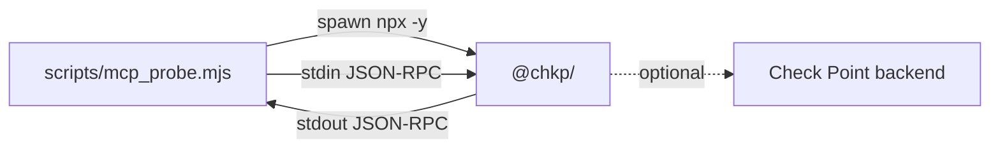

# Scenario: Local MCP Probing

Use this scenario when you want to inspect a Check Point MCP package without deploying AWS resources. It is the fastest way to answer questions such as "Which tools does this package expose?", "What MCP protocol version does it negotiate?", and "Can a specific tool call reach my Check Point backend?"

This scenario uses [scripts/mcp_probe.mjs](../../scripts/mcp_probe.mjs), a small stdio MCP client included in this repo.

## What This Scenario Proves

The local probe proves the MCP server process starts, speaks JSON-RPC over stdio, responds to `initialize`, accepts the `notifications/initialized` notification, and returns a tool catalog from `tools/list`.

It does not prove AgentCore Gateway, Cognito, SigV4, ECR, CodeBuild, or AgentCore Runtime. Those are covered by [MCP tools implementation](mcp-tools-on-agentcore.md).

## Request Flow



The probe sends newline-delimited JSON-RPC messages through the child process stdin and reads JSON-RPC responses from stdout. It ignores non-JSON log lines so ordinary server logging does not break the tool listing.

## Prerequisites

| Need | Notes |
|---|---|
| Node.js | Node.js 20+ is recommended. |
| npm registry access | `npx -y` downloads the selected `@chkp/*` package at runtime. |
| Check Point credentials | Not needed for static `tools/list` on many packages, but needed for real tool calls. |
| Network access | Needed only when the server package or real backend call needs it. |

Disable package telemetry in local demos with `TELEMETRY_DISABLED=true`. The probe sets that variable for the spawned process by default.

## Inspect the documentation server's tools without an API key

The documentation server registers its tool catalog from a region alone, so
`tools/list` works with no Infinity Portal key (real doc *retrieval* needs
`CLIENT_ID`/`SECRET_KEY`):

```bash
node scripts/mcp_probe.mjs @chkp/documentation-mcp --region LOCAL
```

Expected behavior:

1. The probe spawns `npx -y @chkp/documentation-mcp --region LOCAL`.
2. It sends `initialize` with protocol version `2025-06-18`.
3. It sends `notifications/initialized`.
4. It sends `tools/list`.
5. It prints the negotiated server information and every returned tool.

## Inspect Quantum Management With Dummy Inputs

Quantum Management registers its tool catalog statically, so dummy values are enough to inspect `tools/list`:

```bash
node scripts/mcp_probe.mjs @chkp/quantum-management-mcp \
  --management-host 127.0.0.1 \
  --management-port 443 \
  --api-key DUMMY
```

This proves package startup and tool registration. It does not prove a live Management API call because the host and key are placeholders.

## Call a Tool Against a Real Backend

Only run this locally with real credentials that are safe for your environment. Do not paste secrets into chat, commit them to the repo, or put them into shell history if that is against your local policy.

Example with environment variables:

```bash
export MANAGEMENT_HOST="<management-host>"
export MANAGEMENT_PORT="443"
export API_KEY="<read-only-api-key>"

node scripts/mcp_probe.mjs @chkp/quantum-management-mcp \
  --call show_hosts '{}'
```

Example with Smart-1 Cloud-style values, if the selected server package expects them:

```bash
export S1C_URL="<smart-1-cloud-url>"
export API_KEY="<read-only-api-key>"

node scripts/mcp_probe.mjs @chkp/quantum-management-mcp \
  --call show_hosts '{}'
```

The probe truncates a tool call result to 3000 characters so a large response does not flood the terminal.

## How the Probe Is Implemented

[scripts/mcp_probe.mjs](../../scripts/mcp_probe.mjs) does five things:

1. Reads the package name from the first CLI argument.
2. Treats every argument before `--call` as a server argument and passes it directly to `npx`.
3. Spawns the package with `stdio: ['pipe', 'pipe', 'pipe']` and `TELEMETRY_DISABLED=true`.
4. Implements tiny JSON-RPC helpers: `send(method, params)` for request/response and `notify(method, params)` for notifications.
5. Runs the MCP sequence: `initialize`, `notifications/initialized`, `tools/list`, and optional `tools/call`.

The client does not use the full MCP SDK. That is intentional. It keeps local probing dependency-free beyond Node.js and makes the wire sequence visible.

## Important Transport Detail

Check Point MCP servers are safe to run locally over stdio. Some also support an HTTP transport, but that transport is not internet-safe by itself:

```bash
MCP_TRANSPORT_TYPE=http npx -y @chkp/quantum-management-mcp \
  --transport http \
  --transport-port 3000
```

That exposes MCP endpoints on the chosen port without the full auth and TLS envelope you need for a remote service. For remote use, put the server behind a real authenticated boundary such as AgentCore Runtime and Gateway, an authenticated reverse proxy, or another equivalent control plane.

## Credential Shapes

Common server families use different environment variables. Check the selected package with `--help` before a customer run.

| Package family | Typical inputs |
|---|---|
| Quantum Management, on-prem | `MANAGEMENT_HOST`, optional `MANAGEMENT_PORT`, and `API_KEY` or username/password. |
| Smart-1 Cloud | `S1C_URL` and `API_KEY`. |
| Harmony SASE | `MANAGEMENT_HOST`, `API_KEY`, and product-specific origin or tenant values. |
| Documentation | Region or local mode; no management API key for basic docs probing. |

The exact input names are controlled by the upstream `@chkp/*` package, not by this probe.

## Troubleshooting

| Symptom | Likely cause | Fix |
|---|---|---|
| `usage: node mcp_probe.mjs <@chkp/pkg>` | No package argument was provided. | Pass a package such as `@chkp/documentation-mcp`. |
| `TIMEOUT after 90s` | Package download, package startup, or backend call hung. | Check network access, package name, credentials, and server stderr tail. |
| No tools printed | Server returned an empty catalog or failed before `tools/list`. | Run the package with `--help`; verify required startup inputs. |
| Tool call fails but `tools/list` works | Catalog registration is static, but the backend call needs real connectivity and credentials. | Replace dummy values with valid read-only credentials and verify backend reachability. |
| JSON parse errors are not visible | The probe intentionally ignores non-JSON stdout lines. | Check stderr output and package logs. |

## When to Move to MCP tools

Move from local probing to [MCP tools implementation](mcp-tools-on-agentcore.md) when you need one or more of these properties:

- A shared MCP endpoint for multiple agents.
- TLS and inbound authentication handled by AWS.
- Server-side credential storage in Secrets Manager.
- AgentCore Gateway target aggregation.
- A repeatable workshop or field demo path.