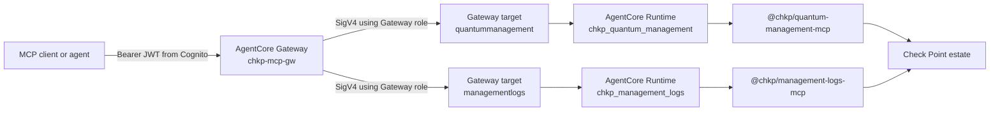

# Scenario: MCP Tools on AgentCore

This is the runnable scenario in this repository: it exposes Check Point MCP servers as tools an agent can call through one AWS Bedrock AgentCore Gateway.

This is a field-tested reference pattern assembled from GA AWS building blocks. It is not a one-click Check Point or AWS product integration.

## What This Scenario Builds

The build scripts create one generic container image, one AgentCore Runtime per selected Check Point MCP server, one AgentCore Gateway, and one Gateway target per runtime. The Gateway aggregates the targets into a single MCP catalog.



## Where the MCP tools sit on AgentCore

<p align="center">
  
</p>

This path uses three AgentCore building blocks: the **Runtime** hosts the `@chkp` MCP server container, the **Gateway** aggregates it (and any other servers) into one MCP endpoint, and **Identity** carries the inbound/outbound authentication. The `@chkp` MCP servers are the always-present core of this scenario. An **optional** AI guardrail can screen prompts before the model runs — it is your choice and is not required to run this scenario. When enabled, you pick either engine: the cloud-native default (AWS AgentCore Policy / Bedrock Guardrails, provider `gateway`) enforces at this same Gateway, or Check Point's own **AI Guardrail (Lakera Guard)** (provider `lakera`), a drop-in opt-in that screens client-side in the CLI. See [AI guardrail design](ai-guardrail-design.md).

## When to Use It

Use MCP tools when:

- More than one agent needs the same Check Point tool catalog.
- You want one authenticated MCP endpoint instead of direct local stdio connections.
- You want Check Point credentials loaded server-side from Secrets Manager.
- You want Gateway target aggregation and namespacing.
- You are running a repeatable demo, workshop, or field validation.

Use [local MCP probing](local-mcp-probe.md) instead when you only need to inspect package tools on your workstation.

## Commands

Cross-platform CLI (Windows, macOS, Linux):

```bash
python3 -m pip install --upgrade boto3
python3 -m chkpmcpaws deploy
```

AWS CloudShell / bash wrapper (forwards to the same CLI):

```bash
bash scripts/build.sh
```

Custom server set (commas or spaces):

```bash
python3 -m chkpmcpaws deploy --servers "quantum-management reputation-service"
SERVERS="quantum-management reputation-service" bash scripts/build.sh
```

Server names are written without the `@chkp/` prefix and without the `-mcp` suffix. The CLI turns `quantum-management` into `@chkp/quantum-management-mcp`. The legacy `python3 scripts/build.py` entry point still works — it is a shim that forwards to `chkpmcpaws deploy`.

## Implementation Walkthrough

The deploy is implemented once, in the cross-platform [chkpmcpaws](../../chkpmcpaws) Python package (boto3 + standard library; no bash, jq, curl, or local Docker needed). `scripts/build.sh` is a thin CloudShell bootstrap that forwards to it, so every platform runs the same code path with the same fixed resource names.

### 1. Region, Identity, and Server Selection

The CLI defaults to `us-east-1` (`--region` overrides it; keep verify/destroy pointed at the same region as the deploy). It reads the AWS account ID through STS and uses it to build account-scoped resource names such as the ECR image URI and S3 source bucket. All names derive from [chkpmcpaws/config.py](../../chkpmcpaws/config.py) — `--prefix` namespaces every name for a parallel stack.

Default server set — 9 of the 15-server catalog (excluded: `cloudguard-waf`, `spark-management`, `harmony-sase`, `workforce-ai` need tenant credentials; `argos-erm` won't reach READY on placeholders; `quantum-gaia` uses interactive-only auth the gateway can't relay):

```text
quantum-management management-logs threat-prevention https-inspection
policy-insights quantum-gw-cli reputation-service threat-emulation
documentation
```

For each server `s`, the runtime name is:

```text
chkp_<s with hyphens converted to underscores>
```

The Gateway target name is:

```text
<s with hyphens removed>
```

That is why tools are namespaced like `quantummanagement___show_hosts`.

### 2. Placeholder Secrets (one per server)

The build creates or updates **one placeholder secret per credentialed server**, named `chkp/<server>` — e.g. `chkp/quantum-management`, `chkp/management-logs`, `chkp/cloudguard-waf`. Each runtime reads only its own secret, so different servers can hold different credentials.

A management-shaped placeholder value looks like:

```json
{"MANAGEMENT_HOST":"127.0.0.1","MANAGEMENT_PORT":"443","API_KEY":"PLACEHOLDER_NOT_A_REAL_KEY"}
```

These prove the runtime can read from Secrets Manager. They are not real Check Point credentials and should not be used for live tool calls — replace them via `chkpmcpaws creds` (see [go-live](go-live-and-operations.md#credentials)).

### 3. Runtime Execution Role

The scripts create the IAM role:

```text
AgentCoreRuntimeChkpMcp
```

Trust policy summary:

- Principal: `bedrock-agentcore.amazonaws.com`.
- Source account constrained to the current AWS account.
- Source ARN scoped to Bedrock AgentCore resources in `us-east-1` for the current account.

Inline policy summary:

| Permission area | Why it is needed |
|---|---|
| ECR image pull | The runtime pulls the generic container image. |
| ECR auth token | Required before pulling from ECR. |
| CloudWatch Logs | Runtime logs need log groups and streams. |
| CloudWatch metrics | AgentCore runtime metrics. |
| Workload access token calls | AgentCore runtime workload identity support. |
| Secrets Manager read | The entrypoint loads the Check Point credential secret. |

The `Workload access token calls` resource is wildcarded across the **entire** workload-identity directory, not scoped to one runtime or agent name — deliberate, since this one role is shared by every Runtime you create (see *Extending the Server Set* below). If you need per-server isolation instead of a shared role, narrow this resource and give each Runtime its own execution role.

### 4. Generic Container Source

The image is intentionally generic. It does not bake a specific Check Point MCP server into the container.

The generated `entrypoint.mjs` does this at container startup:

1. Reads `AWS_REGION` and `CHKP_SECRET_ARN` from the runtime environment.
2. If `CHKP_SECRET_ARN` is set, calls Secrets Manager `GetSecretValue`.
3. Parses the secret JSON and copies each key/value into `process.env`.
4. Reads `CHKP_PKG`, defaulting to `@chkp/quantum-management-mcp`.
5. Spawns:

```text
npx -y <CHKP_PKG> --transport http --transport-port 8000
```

The generated Dockerfile uses `node:20-slim` on `linux/arm64`, installs `@aws-sdk/client-secrets-manager`, copies the entrypoint, exposes port `8000`, and runs the entrypoint with Node.js.

### 5. CodeBuild Image Build

The scripts create:

| Resource | Name |
|---|---|
| ECR repo | `bedrock-agentcore-chkpmcp` |
| CodeBuild role | `ChkpMcpCodeBuild` |
| CodeBuild project | `chkp-mcp-build` |
| S3 source bucket | `chkp-mcp-src-<account>` |

The source bundle contains only:

- `entrypoint.mjs`
- `Dockerfile`
- `buildspec.yml`

CodeBuild uses an ARM container environment and privileged mode to build and push:

```text
<account>.dkr.ecr.us-east-1.amazonaws.com/bedrock-agentcore-chkpmcp:v1
```

This is why the user does not need local Docker.

### 6. One Runtime Per Server

For every selected server, the script creates an AgentCore Runtime with:

| Setting | Value |
|---|---|
| Runtime name | `chkp_<server_with_underscores>` |
| Artifact | The shared ECR image URI. |
| Role | `AgentCoreRuntimeChkpMcp` |
| Network mode | `PUBLIC` |
| Server protocol | `MCP` |
| `CHKP_PKG` | `@chkp/<server>-mcp` |
| `CHKP_SECRET_ARN` | ARN of the server's own secret, `chkp/<server>` |
| `AWS_REGION` | `us-east-1` |

The scripts wait for every runtime to reach `READY` before creating Gateway targets.

### 7. Cognito Inbound Authentication

The scripts create a Cognito user pool named:

```text
gateway-user-pool
```

They also create:

- Resource server: `gateway-resource-server`.
- Scope: `gateway-resource-server/read`.
- App client: `gateway-client` with client-credentials flow and a generated secret.
- Hosted domain: `chkp-mcp-gw-<account>`.

The Gateway uses Cognito's OpenID discovery document as its custom JWT authorizer source:

```text
https://cognito-idp.us-east-1.amazonaws.com/<pool-id>/.well-known/openid-configuration
```

The client secret is used only during the build verification step. The scripts do not print it.

### 8. Gateway Service Role

The Gateway assumes:

```text
AgentCoreGatewayRole
```

The inline policy grants `bedrock-agentcore:InvokeAgentRuntime` on AgentCore runtime ARNs in the account and region. That lets the Gateway call the runtime invocation endpoints with SigV4.

### 9. Gateway Creation

The scripts create:

```text
chkp-mcp-gw
```

Important settings:

| Setting | Value |
|---|---|
| Protocol type | `MCP` |
| Authorizer type | `CUSTOM_JWT` |
| Discovery URL | Cognito OpenID discovery URL. |
| Allowed clients | The generated Cognito app client ID. |

Use **allowed clients**, not an allowed-audience setting. `client_credentials` tokens from Cognito carry no `aud` claim, so an audience-based authorizer configuration will reject every token even though the token itself is valid — this is the most common way to misconfigure the authorizer if you build the Gateway by hand instead of through the scripts.

The script waits for the Gateway to reach `READY` and records the Gateway URL.

### 10. Gateway Targets

For each runtime, the script builds an AgentCore runtime invocation endpoint:

```text
https://bedrock-agentcore.us-east-1.amazonaws.com/runtimes/<url-encoded-runtime-arn>/invocations?qualifier=DEFAULT
```

Then it registers that endpoint as an MCP-server target with:

| Setting | Value |
|---|---|
| Target type | MCP server endpoint. |
| Listing mode | `DEFAULT` |
| Outbound credential provider | Gateway IAM role. |

The script waits for every target to reach `READY`.

### 11. Verification Through the Gateway

The scripts request a Cognito access token with client credentials:

| Field | Value |
|---|---|
| Grant type | `client_credentials` |
| Client ID | Generated Cognito app client ID. |
| Client secret | Generated Cognito app client secret. |
| Scope | `gateway-resource-server/read` |

Then they attempt `tools/list` through the Gateway.

The final verification uses the optional `mcp` package. If `mcp` is missing, the stack still comes up, the deploy exits successfully with a hint, and `python3 -m chkpmcpaws status` falls back to a pure-stdlib first-page listing until you `python3 -m pip install mcp`.

Expected output shape — one line per deployed server (9 on a default deploy):

```text
TOTAL TOOLS THROUGH THE GATEWAY: <number>
  documentation: <count>
  httpsinspection: <count>
  managementlogs: <count>
  policyinsights: <count>
  quantumgwcli: <count>
  quantummanagement: <count>
  reputationservice: <count>
  threatemulation: <count>
  threatprevention: <count>
```

The build runs this check once, right after creation, so it can fire before the Cognito hosted domain has finished propagating (you may see `could not obtain a Cognito token yet`). To re-run the same verification against an already-deployed stack at any time, without rebuilding, use the read-only re-verifier:

```bash
python3 -m chkpmcpaws status
```

See [Tool catalog verification](go-live-and-operations.md#tool-catalog-verification) for details.

## Go-Live Credential Model

Every credentialed server gets its **own** Secrets Manager secret (`chkp/<server>`), so credentials are already separated by server and privilege boundary — `quantum-management` and `management-logs` can point at different management servers with different API keys. The default deploy brings up 9 of the 15 servers (excluded: `cloudguard-waf`, `spark-management`, `harmony-sase`, `workforce-ai` for tenant credentials; `argos-erm`; and `quantum-gaia`, whose interactive-only auth the gateway can't relay).

For details, see [go-live and operations](go-live-and-operations.md).

## Extending the Server Set

To deploy a catalog server that isn't in the default set, pass its short name:

```bash
python3 -m chkpmcpaws deploy --servers "quantum-management cloudguard-waf reputation-service"
```

Server names must come from the catalog in [chkpmcpaws/config.py](../../chkpmcpaws/config.py) (`SERVER_CATALOG`) — the CLI validates them and rejects unknown names. To support a brand-new `@chkp` package, first register it there (name, credential shape, version); the generic image then picks it up automatically because `CHKP_PKG` selects the package at runtime.

Each newly added server automatically gets its own `chkp/<server>` secret (with placeholder values); put its real credentials in with `chkpmcpaws creds template` / `creds apply`, which writes that server's secret and restarts its runtime.

## Rebuild and Idempotency Notes

Teardown is designed to be idempotent. The build path is a quick field-deploy path, not a full declarative state engine.

Practical guidance:

- Re-running the deploy is safe: existing runtimes, the gateway, the Cognito pool/client/domain, and the secret are found and reused by name. If the reused gateway trusts a stale Cognito client (a leftover from older builds), the deploy re-points its authorizer automatically.
- A partial deploy exits **non-zero** and lists exactly which steps failed — re-run it, or run teardown and rebuild. A zero exit means everything requested actually materialized.
- Do not run parallel builds with the same names in one account/region. For a second stack, use `--prefix <name>` (note: gateway target names change with it, so tool namespaces do too).
- A secret scheduled for deletion by a recent teardown is restored automatically on rebuild.

## Verification Checklist

After a successful build, verify:

```bash
aws bedrock-agentcore-control list-gateways --region us-east-1
aws bedrock-agentcore-control list-agent-runtimes --region us-east-1
```

Then inspect the script output for:

- Gateway URL.
- Server list.
- Target readiness messages.
- `TOTAL TOOLS THROUGH THE GATEWAY` if the MCP verification ran.

If tool listing works but a real tool call fails, the most likely cause is still placeholder credentials.

## Security Notes

- The raw Check Point MCP HTTP transport is not exposed directly. It is hosted inside AgentCore Runtime and reached through Gateway target invocation.
- The Gateway is protected by Cognito JWT validation.
- Runtime-to-Check Point credentials come from Secrets Manager.
- The sample stack uses public runtime networking for simplicity. For production, revisit private connectivity, egress control, and inspection requirements.
- Use read-only or least-privilege Check Point API credentials wherever possible.
- The on-prem `@chkp/quantum-infra` client disables TLS certificate verification when talking to `MANAGEMENT_HOST` — see [TLS verification on the on-prem client](go-live-and-operations.md#tls-verification-on-the-on-prem-client) before a customer run.

## Troubleshooting

| Symptom | Likely cause | Fix |
|---|---|---|
| `UnknownServiceError` in Python | boto3/botocore predates AgentCore. | `python3 -m pip install --upgrade boto3 botocore` |
| `aws bedrock-agentcore-control` is unknown | AWS CLI v2 is too old. | Upgrade AWS CLI v2. |
| `AccessDeniedException` | IAM principal lacks required permissions. | Add permissions for AgentCore, IAM, Cognito, ECR, CodeBuild, S3, Logs, and Secrets Manager. |
| CodeBuild fails before Docker build | IAM propagation or CodeBuild role policy issue. | Wait briefly, retry, and inspect CodeBuild logs. |
| Runtime never reaches `READY` | Image pull, env var, startup, or package issue. | Check runtime status and CloudWatch logs. |
| Target never reaches `READY` | Runtime not ready or target endpoint malformed. | Verify runtime ARN encoding and runtime status. |
| Gateway lists tools but calls fail | Placeholder or wrong product credentials. | Replace the secret and update runtime env for the product family. |
| Cognito token fails at first | Hosted domain propagation. | Wait a few minutes and retry verification. |